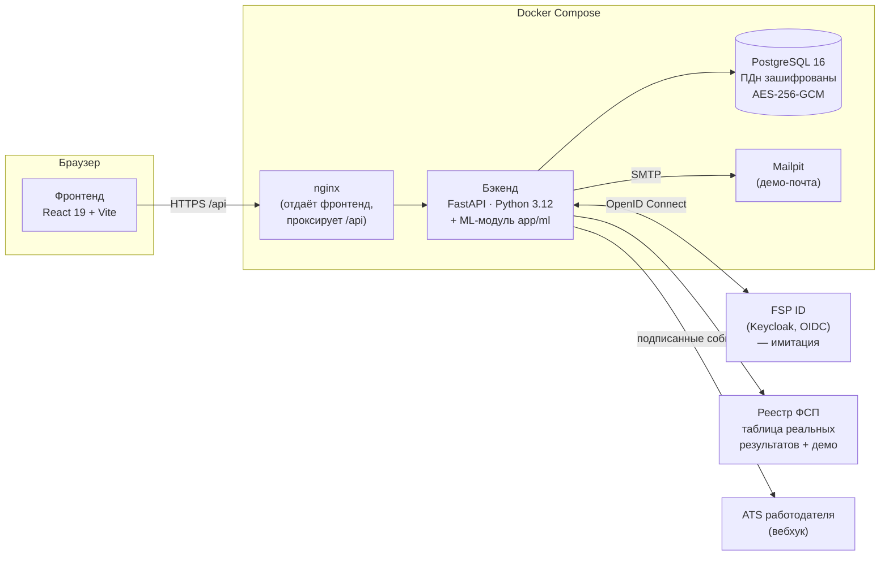
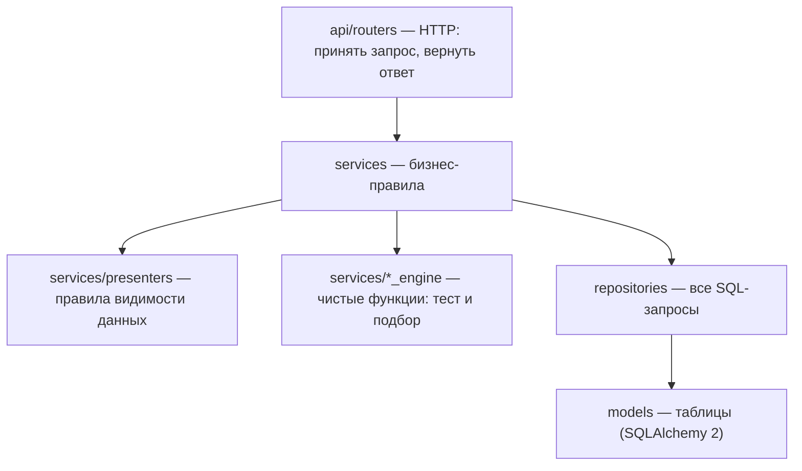
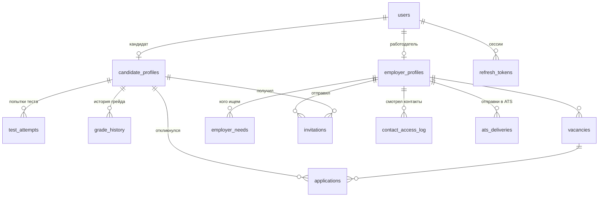

# 1. Архитектура

## Общая схема



**Один бэкенд-сервис с явным разделением слоёв**, в том числе ML-модуль: вся серверная часть на Python,
поэтому ML-код подключается напрямую (`backend/app/ml`), без отдельного сервиса и сетевого контракта.
ТЗ это прямо разрешает («допустим и монолит с явным разделением слоёв»). Зоны ответственности команды разделены
по папкам, а не по микросервисам.

Каждая внешняя зависимость спрятана за интерфейсом и имеет запасной вариант. Демо не падает, если её нет:

| Внешняя система | Интерфейс в коде | Если недоступна |
|---|---|---|
| ML-разбор резюме (GigaChat) | `app/ml/resume.py` или ML-сервис `POST /api/cv/parse` по `ML_SERVICE_URL` | встроенный парсер PDF (pypdf + правила) |
| ML-похожесть «вакансия ↔ кандидат» | `app/ml/matching.py` | встроенный TF-IDF |
| Реестр ФСП | `services/fsp_service.py` → `FspRegistryClient` | таблица реальных результатов, затем демо-реестр |
| FSP ID (Keycloak) | `services/fsp_id_client.py` | встроенная имитация реалма ФСП; обычный вход по почте |
| Почта | `services/email_service.py` | письма пишутся в журнал |
| ATS работодателя | `services/ats_service.py` | ошибка записывается в журнал отправок, основной сценарий не страдает |

## Слои бэкенда



- **Роутеры** ничего не решают: принимают запрос, проверяют роль через зависимость и вызывают сервис.
- **Сервисы** проверяют бизнес-правила: кулдауны, переходы статусов, кто что может.
- **Движки** (`testing_engine.py`, `matching_engine.py`) — это чистые функции без базы данных. Поэтому один и тот же код
  обслуживает и API, и скрипт валидации `scripts/evaluate.py`: валидируется настоящий код продукта, а не его копия.
- **Презентеры** решают, какие поля кому показать. Главное правило ТЗ — контакты только после согласия
  кандидата — живёт в одном месте (`contact_basis`).
- **Репозитории** — единственное место, где пишутся SQL-запросы.

## Структура репозитория

```
backend/
  app/
    main.py              точка входа: роутеры, CORS, единый формат ошибок, заголовки безопасности
    core/                настройки, БД, JWT и пароли, шифрование ПДн, лимиты, зависимости ролей
    models/              таблицы БД
    schemas/             Pydantic-схемы = контракт API
    repositories/        SQL-запросы
    services/            бизнес-логика (тестирование, подбор, приглашения, ФСП, FSP ID, ATS, PDF, почта)
    ml/                  ML-часть команды: разбор резюме, похожесть текстов (контракт — ml/README.md)
    api/routers/         HTTP-эндпоинты
    testing_bank/        банк параметризованных шаблонов заданий
  alembic/versions/      миграции схемы БД (0001–0005)
  scripts/               seed (демо-данные), evaluate (валидация), load_test (нагрузка),
                         fsp_data (реальные результаты ФСП), encryption (ключи шифрования)
  tests/                 автотесты API (pytest)
  data/                  таблица реальных результатов ФСП и её шаблон
docs/                    эта документация
docker-compose.yml       запуск всего проекта одной командой
```

## Модель данных (основное)



17 таблиц. Персональные данные (ФИО, телефон, Telegram, почта для связи, текст резюме, контакты HR,
ответ кандидата, секрет ATS) хранятся **зашифрованными**, подробнее в [09_security_152fz.md](09_security_152fz.md).

## Почему такие технологии

| Выбор | Почему |
|---|---|
| Python + FastAPI | Документация API (Swagger/OpenAPI) генерируется из кода автоматически, валидация входных данных встроена; на Python же написаны ML-часть и валидация |
| PostgreSQL | Надёжная транзакционная БД, JSON-поля для навыков и достижений |
| SQLAlchemy 2 + Alembic | Модели как классы, изменения схемы — версионированными миграциями (вверх и вниз) |
| JWT в формате Keycloak | Те же поля (`sub`, `realm_access.roles`), поэтому переход на FSP ID не ломает проверку прав |
| Docker Compose | Стенд жюри поднимается одной командой, независимо от ОС |
