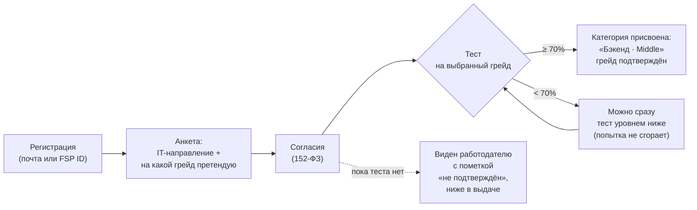

# 2. Механика тестирования и присвоения грейда

## Путь кандидата

- **«Отрасль» из ТЗ** — это IT-направление (бэкенд, фронтенд, Data Science, QA, DevOps); так её уточнили организаторы.
  Сфера бизнеса (финтех, ритейл…) — необязательное пожелание кандидата и на категорию не влияет.
- **Грейд кандидат выбирает сам, а тест его подтверждает или нет.** Категорию (специализация + грейд) ставит
  только сервер по итогам теста. Ни работодатель, ни сам кандидат, ни достижения ФСП её не меняют.
- **Кандидат без пройденного теста не исчезает.** По рекомендации организаторов он виден работодателю со статусом
  «грейд не подтверждён: заявлен кандидатом», но ранжируется ниже: его балл умножается на 0.6, а вклад теста
  равен нулю. Работодатель может включить фильтр «только подтверждённые» (`only_verified=true`).

## Как строится тест

| Шаг | Что происходит | Зачем |
|---|---|---|
| План (blueprint) | 10 заданий: 5 уровня грейда, 3 уровнем ниже, 2 уровнем выше | Одинаковая сложность для всех, кто идёт на один грейд, и отличие соседних грейдов |
| Выбор шаблонов | Случайно (seed попытки) из банка нужного уровня и направления | У каждого кандидата свой набор |
| Параметры | Внутри шаблона — случайные числа, имена, данные | Одинаковых заданий почти не бывает, ответы бесполезно пересылать друг другу |
| Вес | Задание уровня L весит L+1 | Сложное задание весит больше |
| Виды заданий | `single` (выбор варианта), `input` (короткий ответ), `code` (функция на Python) | Проверяются и знания, и умение писать код |
| Таймер | 30 минут, отсчёт на сервере (`seconds_left`) | Перезагрузка страницы не сбрасывает время; ответы после дедлайна (+1 минута на сеть) не засчитываются |

**Правильные ответы никогда не уходят на фронтенд.** Задачи с кодом проверяются на сервере на **скрытых** тестах:
код сначала проходит статический анализ (запрещены опасные импорты и функции), затем запускается в отдельном процессе
с лимитами времени и памяти. Кнопка «Запустить» в браузере (Pyodide) — только для удобства кандидата,
зачёт ставит сервер.

**Наполнение банка заданий** — зона ML-участника команды (см. раздел ML в документации). Бэкенд отвечает за механику:
генерацию вариантов, план по уровням, проверку и подсчёт баллов. Шаблон задания — функция, которая по случайному
генератору возвращает текст, варианты и правильный ответ (`backend/app/testing_bank/bank.py`).

## Правила грейда

| # | Правило | Обоснование |
|---|---|---|
| 1 | Порог прохождения — **70%** (взвешенно по сложности) | Совпадает с рекомендацией организаторов («7 из 10») |
| 2 | **Грейд не понижается** принудительно: провал теста на уровень выше ничего не отнимает | Иначе кандидат боится пробовать и платформа теряет сильных людей |
| 3 | Не прошёл на заявленный уровень — **можно сразу пройти тест уровнем ниже**, попытка не сгорает | Прямая рекомендация организаторов |
| 4 | **Смена грейда — не чаще раза в 90 дней** | «Нельзя сегодня быть Junior, завтра Senior, послезавтра Middle» |
| 5 | Исключение: сдал свой уровень на **90%+** — можно сразу пробовать следующий | Явно сильный кандидат не должен ждать 3 месяца |
| 6 | **Повышение — только отдельным тестом** на следующий уровень, без автоматического прыжка | Рекомендация организаторов |
| 7 | Пересдача на тот же уровень — **не чаще раза в 24 часа** | Защита от перебора банка заданий |
| 8 | Одна активная попытка | Нельзя открыть несколько вариантов и выбрать удобный |

Все сроки и пороги вынесены в настройки (`GRADE_CHANGE_COOLDOWN_DAYS`, `TEST_RETRY_COOLDOWN_HOURS`,
`TEST_PASS_THRESHOLD` и т.д.), меняются без правки кода.

## Калибровка банка

Для каждого шаблона копится статистика (`question_stats`): сколько раз показан, сколько раз решён и средний балл
решивших и не решивших. Отсюда видны задания, которые оказались слишком лёгкими или не отличают сильных кандидатов
от слабых. Результаты на синтетической выборке приведены в [04_validation.md](04_validation.md).

## Что видит работодатель

В карточке кандидата: категория («Бэкенд · Middle»), `grade_verified` и подпись статуса, балл теста, дата
подтверждения, сильные темы теста (навыки с результатом 80%+). У кандидата без теста балла нет,
а статус подписан явно: «Не подтверждён: заявлен кандидатом».
