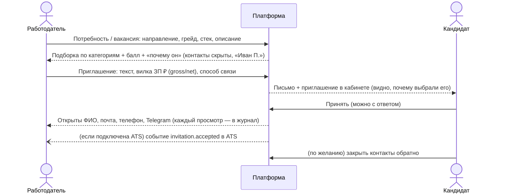

# 3. Механика подбора и логика категоризации

## Обратная механика

Работодатель не ждёт откликов. Он открывает **уже категоризированную базу**, видит объяснимую подборку и сам
отправляет кандидату **адресное приглашение** с обязательной вилкой зарплаты в рублях. Контакты кандидата скрыты,
пока тот не принял приглашение.



## Категоризация

**Категория = специализация + грейд**, например «Бэкенд · Middle». Её присваивает **только тест**.
Кандидаты без теста видны по заявленной категории с пометкой «не подтверждён» и ниже в выдаче.

Ответ подборки сначала даёт **блоки категорий**: «Бэкенд · Middle — 34 (30 подтверждены тестом, с ФСП — 9,
средний балл 82)». Работодатель видит структуру базы, а не бесконечный список.

## Ранжирование внутри категории

Шаг 1 — **фильтр** по специализации и грейду. Нужный грейд берётся вместе с соседними, но со штрафом.
Шаг 2 — **скоринг**, взвешенная сумма понятных компонент (каждая от 0 до 1):

| Компонента | Вес | Что значит |
|---|---:|---|
| `test` — балл теста / 100 | 0.35 | Насколько подтверждён уровень (у неподтверждённых 0) |
| `skills` — доля требуемых навыков, которые есть | 0.35 | Совпадение стека |
| `fsp` — сила достижений ФСП | 0.15 | Объективные соревнования (0, если истории нет) |
| `activity` — свежесть профиля + короткие задания | 0.10 | Актуальный сигнал |
| `text` — TF-IDF-похожесть описания вакансии и резюме | 0.05 | Опыт перекликается с задачами команды |

Итог: `балл = 100 × Σ wᵢ·xᵢ / Σ wᵢ × множители`. Компоненты без сигнала (например, стек не задан) не учитываются.
Множители: грейд на ступень ниже или выше ×0.7, на две ступени ×0.5; грейд не подтверждён тестом ×0.6.
Веса подобраны на валидации (раздел 4), лежат в настройках (`RANK_W_*`) и меняются без правки кода.

**Почему так:** резюме может «врать», тест — нет. Поэтому тест и реальный стек весят больше всего, а текстовая
похожесть, на которой строится обычный поиск по ключевым словам, — меньше всего. Валидация показывает, что такой
ранкер находит релевантных кандидатов лучше поиска по ключевым словам.

## Достижения ФСП: только внутри категории

По ответам организаторов ФСП **влияет на позицию внутри категории, но не на грейд**. Балл ФСП (0–1):

- считается по **результативности**, а не по «важности» соревнования. Все соревнования и дисциплины равны,
  «чемпионат России выше хакатона» не делаем;
- 1/2/3 место дают 1.0 / 0.85 / 0.7 очка; финал без призового места — 0.3; участие — 0.15;
- **непризовое участие в сумме — не больше 0.6 очка**: профиль нельзя набить одними онлайн-явками;
- итог насыщается: `1 − e^(−очки/1.2)`. Одна победа ≈ 0.57, две призовых ≈ 0.79, любые участия без призов ≤ 0.39;
- **нет истории ФСП → 0, кандидат остаётся в выдаче** с плашкой «Нет истории ФСП — оценка по тесту»
  (обязательный по ТЗ случай, покрыт автотестами).

Уровень соревнования и спортивный разряд (КМС, 1 разряд…) показываются работодателю, но на балл не влияют.

## Объяснимость: «почему он»

Каждый кандидат в выдаче приходит с **плашками** (`reasons`) и **разложением балла** (`breakdown`):

```json
"reasons": [
  {"type": "test",   "positive": true,  "label": "Фронтенд · Middle: тест 93/100"},
  {"type": "skills", "positive": true,  "label": "Стек совпадает 2 из 3: Angular, REST", "missing": ["TypeScript"]},
  {"type": "fsp",    "positive": true,  "label": "ФСП ID 228948: призёр 1 из 2 соревн., лучшее — 2 место · КМС"},
  {"type": "activity","positive": false,"label": "Активен 120 дн. назад"}
],
"breakdown": {"test": {"value": 0.927, "weight": 0.35, "contribution": 32.4}, "...": "...",
              "grade_multiplier": 1.0}
```

Сумма вкладов (`contribution`) равна итоговому баллу, его можно пересчитать руками. Тот же снимок обоснования
сохраняется в приглашении: кандидат видит, почему выбрали именно его.

## Правила видимости

| Что | Кто видит |
|---|---|
| Имя | Работодатель — «Иван П.», пока нет основания (кандидат может открыть полное имя в настройках приватности) |
| Контакты (почта, телефон, Telegram) | Только работодатель, чьё приглашение кандидат **принял**, или на чью вакансию кандидат **сам откликнулся** |
| Отзыв доступа | Кандидат может закрыть контакты обратно (`PUT /api/invitations/{id}/contact-access`) |
| Журнал раскрытий | Кандидат видит, какая компания и когда смотрела его контакты (`GET /api/candidate/contact-access-log`) |
| Профиль целиком | Только при согласии на публикацию; без него кандидат не виден в поиске |

Проверка на сервере, а не скрытие на фронте: без основания поле `contacts` приходит `null`.
