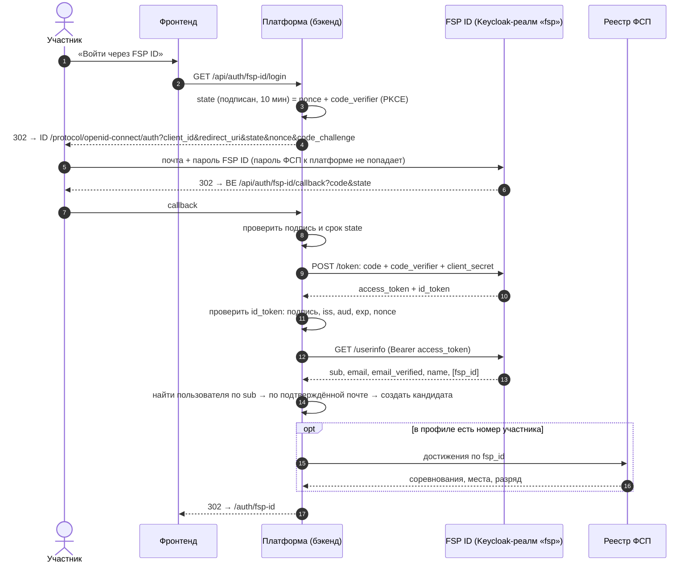
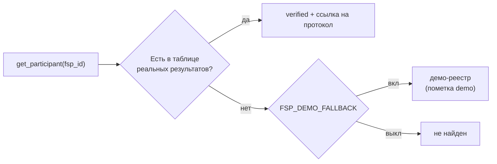

# 5. Интеграция с ФСП и FSP ID

Организаторы: API ФСП и доступов к боевому Keycloak не будет. Ожидается **демонстрационная привязка, имитация
входа через FSP ID и скелет будущей интеграции**. Реальный Keycloak в Docker Compose поднимать не нужно.
Мы сделали две независимые части:

1. **Вход через FSP ID** по настоящему протоколу Keycloak (OpenID Connect) и встроенная имитация реалма ФСП.
2. **Реестр достижений**: реальные результаты из таблицы, демо-реестр и интерфейс под будущий API.

## 5.1. Вход через FSP ID (OpenID Connect, Authorization Code + PKCE)



**Как связываются аккаунты:**
1. по `sub`: этот аккаунт FSP ID уже связан с пользователем платформы (`users.external_sub`);
2. по почте, если FSP ID подтвердил её (`email_verified`): существующий аккаунт платформы связывается с FSP ID;
3. иначе создаётся новый кандидат. Пароль ему не нужен, вход через FSP ID.

**Номер участника может отсутствовать.** Организаторы говорят, что FSP ID сейчас — это по сути почта и пароль.
Тогда вход работает, а кандидат получает профиль «без истории ФСП». Это штатный случай, а не ошибка.
Согласия на обработку и публикацию данных кандидат даёт сам: FSP ID их не заменяет.

**Безопасность протокола:** PKCE (S256), одноразовый код, `nonce` против подмены ответа, подписанный `state`
со сроком жизни против CSRF, точное совпадение `redirect_uri`, проверка подписи и полей `id_token`. Токены
платформы передаются фронтенду во фрагменте URL (`#…`): фрагмент не отправляется на серверы и не попадает в их журналы.

### Имитация FSP ID

`FSP_ID_MODE=mock` (по умолчанию). Внутри бэкенда работает реалм `fsp` по тем же адресам, что у Keycloak:

| Адрес | Что это |
|---|---|
| `/api/mock-fsp-id/realms/fsp/.well-known/openid-configuration` | Описание провайдера (discovery) |
| `/api/mock-fsp-id/realms/fsp/protocol/openid-connect/auth` | Страница входа FSP ID |
| `/api/mock-fsp-id/realms/fsp/protocol/openid-connect/token` | Обмен кода на токены |
| `/api/mock-fsp-id/realms/fsp/protocol/openid-connect/userinfo` | Профиль участника |

Демо-аккаунты FSP ID (пароль `fsp12345`):

| Почта | Кто | Номер участника |
|---|---|---|
| `candidate@demo.ru` | Алексей Смирнов: уже есть на платформе, аккаунты свяжутся по почте | 100098 (много призов, МС) |
| `maria.fsp@demo.ru` | Мария Иванова: новый пользователь | 100245 |
| `olga.fsp@demo.ru` | Ольга Новикова: участник без соревнований | 100500 |
| `ivan.fsp@demo.ru` | Иван Кузнецов: в FSP ID нет номера участника | — |

Проверка без фронтенда: открыть в браузере `http://localhost:8000/api/auth/fsp-id/login?return_to=json`,
войти демо-аккаунтом и увидеть выданные токены.

### Переход на боевой FSP ID

Код платформы менять не нужно, только настройки:

```env
FSP_ID_MODE=oidc
FSP_ID_ISSUER=https://<адрес-keycloak-фсп>/realms/<реалм>
FSP_ID_CLIENT_ID=fsp-talent
FSP_ID_CLIENT_SECRET=<секрет клиента из Keycloak>
```

В Keycloak ФСП регистрируется клиент `fsp-talent` (confidential, Standard Flow, PKCE S256) с адресом возврата
`https://<платформа>/api/auth/fsp-id/callback`. В режиме `oidc` подпись `id_token` проверяется по открытым ключам
реалма (JWKS, RS256). Номер участника удобно отдавать отдельным claim `fsp_id` через mapper атрибута пользователя.

Упрощения имитации (только в режиме `mock`): `id_token` подписан HS256 секретом клиента (стандарт OIDC это
допускает); одноразовость кода контролируется в памяти процесса.

### Совместимость наших токенов с Keycloak

Токены платформы уже имеют поля в формате Keycloak: `sub`, `email`, `typ`, `realm_access.roles`. Если в будущем ФСП
захочет, чтобы платформа принимала токены FSP ID напрямую, достаточно заменить проверку подписи на открытый ключ
реалма в `core/security.py`. Проверки прав по ролям (`core/deps.py`) не изменятся.

## 5.2. Реестр достижений ФСП



| Источник | Пометка | Откуда |
|---|---|---|
| Таблица `backend/data/fsp_results.xlsx` | `verified`, есть `source_url` | Реальные результаты из открытых протоколов, собраны вручную |
| Демо-реестр | `demo` | Правдоподобные данные: по одному ID всегда одни и те же. 6 цифр; оканчивается на 0 — участник без соревнований |
| Будущий API ФСП | `verified` | Новый класс, реализующий `FspRegistryClient`; остальной код не меняется |

Работодатель всегда видит, откуда данные (`fsp_verification`: `verified` / `demo` / `none`). Демо-данные
**не выдаются за проверенные**.

**Что хранится о достижении:** соревнование, дисциплина, уровень, год, место, результат («Финалист», «Участник»),
команда, ссылка на протокол. Об участнике хранится спортивный разряд (3/2/1 разряд, КМС, МС, МСМК, ЗМС).
Набор полей организаторы намеренно не фиксировали, наш вариант может лечь в основу будущего FSP ID.

**Таблица реальных результатов:**
```bash
python -m scripts.fsp_data template   # шаблон с инструкцией: data/fsp_results_template.xlsx
python -m scripts.fsp_data check      # проверка: сколько участников, какие строки с ошибками (с номерами строк)
python -m scripts.fsp_data sync       # обновить достижения у уже привязанных кандидатов
```
Файл подхватывается без перезапуска. ФИО и контакты в таблицу не вносятся: профиль связывается только по номеру
участника (152-ФЗ).

**Как ФСП влияет на подбор:** только на позицию внутри категории, по результативности, без «важности» соревнований.
Подробнее в [03_matching_and_categorization.md](03_matching_and_categorization.md#достижения-фсп-только-внутри-категории).
