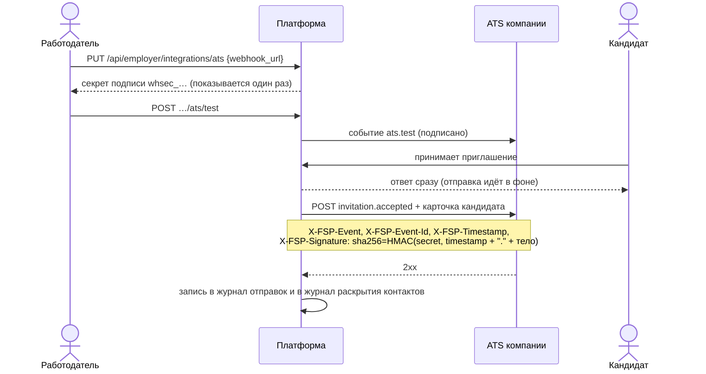

# 10. Интеграция с ATS и защита от фиктивных вакансий

ТЗ относит обе темы к «плюсу за рамками MVP» и ждёт концепцию и архитектурный подход. Для ATS мы сделали рабочий
скелет, для защиты от фиктивных вакансий — заложили основу в данных и описали развитие.

## 10.1. Интеграция с ATS работодателя

**ATS** (Applicant Tracking System) — система, где HR ведёт кандидатов: Хантфлоу, Talantix, Potok и т.п. Задача —
чтобы кандидат, принявший приглашение, сам появлялся в воронке компании, без ручного переноса.

**Что уходит в ATS** (`invitation.accepted`): приглашение (позиция, вилка ЗП, gross/net, ответ кандидата) и
кандидат (ФИО, контакты, направление, грейд и его подтверждённость, балл теста, стек, опыт, сводка ФСП, ссылка
на профиль). Данные уходят **только после согласия кандидата**, то есть после принятия приглашения. Сама передача
фиксируется в журнале «кто видел мои контакты».

**Надёжность и безопасность:** подпись HMAC-SHA256 (ATS проверяет, что событие от нас и не изменено),
`X-FSP-Event-Id` для защиты от дублей, таймаут 5 секунд, отправка в фоне (медленная ATS не задерживает кандидата),
журнал последних отправок с кодом ответа и ошибкой. В продакшене — только https и запрет внутренних адресов
(защита от SSRF).

**Развитие:** повторные попытки с экспоненциальной паузой и очередь (например, Redis/RQ); больше событий
(`application.created`, `invitation.withdrawn`, `contacts.revoked`); готовые коннекторы к API популярных
российских ATS, которые переводят наш формат в их «кандидата» и «вакансию»; обратный канал — статус кандидата из
ATS («собеседование», «оффер») возвращается на платформу и виден кандидату.

## 10.2. Защита от фиктивных вакансий и недобросовестных работодателей

**Уже в системе:**
- **Уровень доверия компании** (`trust_level`): `unverified` → `inn_provided` (указан ИНН) → `verified`. Показывается
  кандидату в приглашении. По совету организаторов проверка — **добровольная метка доверия**, она не блокирует
  основной сценарий.
- **Без названия компании приглашать нельзя** (`COMPANY_PROFILE_INCOMPLETE`): анонимных приглашений нет.
- **Вилка зарплаты обязательна** и подписана (gross/net), поэтому «зарплата по итогам собеседования» невозможна.
- **Одно открытое приглашение кандидату от компании** (`INVITATION_EXISTS`): нельзя засыпать человека.
- **Отзыв доступа к контактам и журнал раскрытий**: кандидат видит, кто брал его данные, и может закрыть доступ.

**Развитие (концепция):**

| Мера | Как |
|---|---|
| Проверка ИНН | Запрос в открытые данные ФНС (ЕГРЮЛ): компания действует, совпадают название и ОКВЭД → `verified` |
| Лимиты для новых компаний | Непроверенная компания — не больше N приглашений в сутки; лимит растёт с долей принятых приглашений |
| Сигналы кандидатов | Кнопка «пожаловаться» в приглашении; несколько жалоб — приглашения компании скрываются до модерации |
| Поведенческие признаки | Много приглашений и почти нет приглашений с последующим наймом (из ATS); одинаковые тексты разным людям; вилка сильно выше рынка для грейда |
| Подтверждение представителя | Вход HR через корпоративную почту на домене компании |
